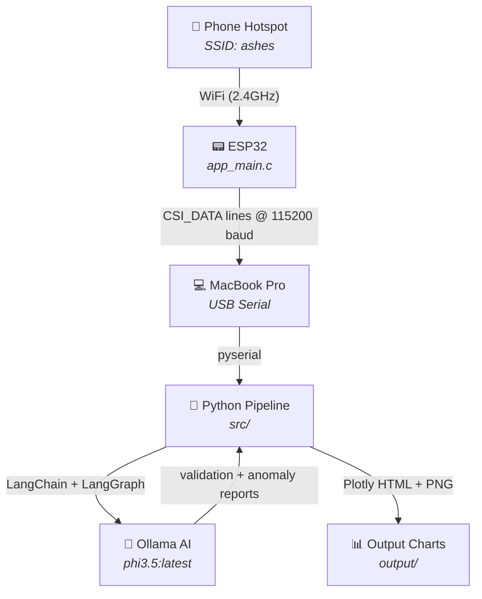
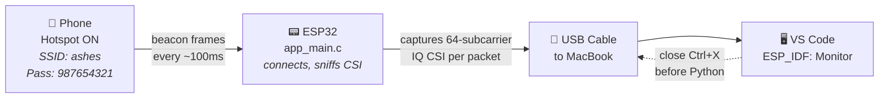
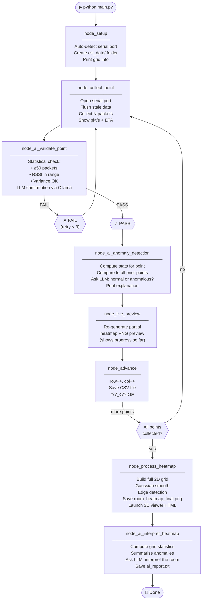
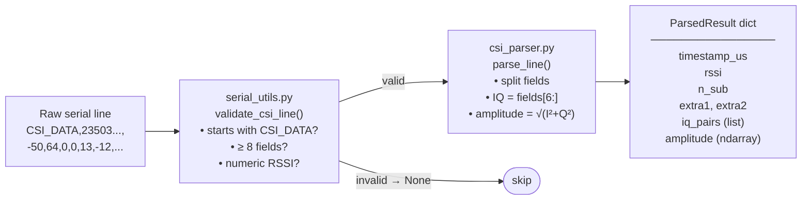
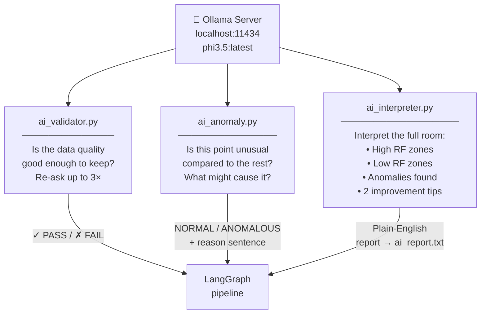
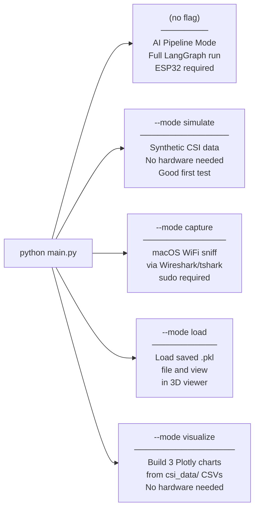
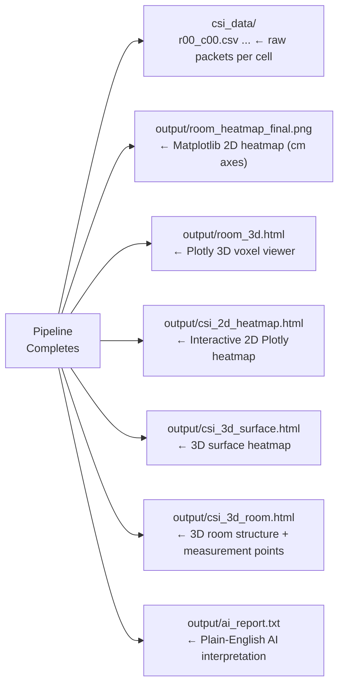

# 📡 ESP32 CSI Room Mapper — Project Flow

---

## 1. System Architecture Overview



---

## 2. Hardware Layer



### What the ESP32 emits on serial

```
CSI_DATA, {timestamp_µs}, {rssi_dBm}, {n_sub}, {extra1}, {extra2}, {I0},{Q0},{I1},{Q1},...
  Field 0      Field 1        Field 2    Field 3   Field 4   Field 5   Field 6 onwards
```

- `n_sub` = 64 subcarriers → **128 IQ values** per packet
- Parsed by `pipeline/csi_parser.py` at field index **6** (after the 6 header fields)

---

## 3. Python Project Structure

```
csi_hotspot/
├── main/
│   └── app_main.c          ← ESP32 firmware (C)
│
└── src/
    ├── main.py             ← Entry point — 5 modes
    ├── serial_monitor.py   ← Standalone ESP32 stream viewer
    ├── test_pipeline.py    ← End-to-end test (no hardware)
    ├── requirements.txt
    │
    └── pipeline/
        ├── csi_parser.py      ← Shared IQ parser (single source of truth)
        ├── serial_utils.py    ← Auto-detect port, read + validate lines
        ├── nodes.py           ← LangGraph node functions
        ├── graph.py           ← LangGraph state machine definition
        ├── validator.py       ← Statistical CSI quality check
        ├── ai_validator.py    ← LLM-based quality check (phi3.5)
        ├── ai_anomaly.py      ← LLM anomaly detection + explanation
        ├── ai_interpreter.py  ← Final LLM room report
        ├── ai_client.py       ← Ollama client config
        ├── heatmap.py         ← Matplotlib heatmap generation
        ├── csi_visualizer.py  ← Plotly 2D/3D charts
        ├── visualizer_3d.py   ← Plotly 3D voxel viewer
        ├── simulator.py       ← Synthetic CSI data (no hardware)
        └── capture_macos.py   ← WiFi packet capture via Wireshark
    │
    └── tools/
        ├── collect_positions.py  ← Guided walk-around capture
        └── esp32_to_pkl.py       ← Convert CSV → .pkl for 3D viewer
```

---

## 4. Main Pipeline Flow (LangGraph State Machine)



---

## 5. CSI Parsing Pipeline



---

## 6. AI Layer



---

## 7. Five Run Modes



### CLI Examples

```bash
# Full pipeline (real ESP32):
python main.py

# Simulate a 500×400×250cm room:
python main.py --mode simulate --room 500x400x250

# Generate 3 Plotly charts from collected data:
python main.py --mode visualize --room 500x400x250 --data csi_data

# Capture via Wireshark (macOS):
sudo python main.py --mode capture --interface en0 --duration 60 --room 500x400x250

# Load + view a saved session:
python main.py --mode load --file esp32_session.pkl
```

---

## 8. Output Files



---

## 9. Room-to-Grid Coordinate System

```
Phone hotspot (TX)
  ★
  │
  │  ← depth (room_height_m)
  │
  ▼
Col→  0        1        2       ...    (N-1)
Row 0 [ 0,0 ] [ 0,1 ] [ 0,2 ]  ...   saves as r00_c00.csv
Row 1 [ 1,0 ] [ 1,1 ] [ 1,2 ]  ...
Row 2 [ 2,0 ] [ 2,1 ] [ 2,2 ]  ...
 ↓
(M-1)
```

**Using floor tiles:** count grout lines (each 60cm tile = 1 grid step).
**Using steps:** ~75cm per stride = use as 1 grid step at `grid_cols/rows` matching.

---

## 10. Quick Start Checklist

```
[ ] Phone hotspot "ashes" is ON
[ ] ESP32 plugged into MacBook via USB
[ ] VS Code → ESP_IDF: Monitor → see CSI_DATA lines → Ctrl+X to close
[ ] Terminal 1: ollama serve  (keep open)
[ ] Terminal 2: cd src && .venv/bin/python3 serial_monitor.py  (check stream)
[ ] Edit src/main.py CONFIG: grid_rows, grid_cols, room_width_m, room_height_m
[ ] Terminal 2: .venv/bin/python3 main.py  (start collection)
[ ] Walk to each grid point, press Enter, wait for AI validation
[ ] After all points: charts auto-open in browser
[ ] .venv/bin/python3 main.py --mode visualize --room 500x400x250
```
